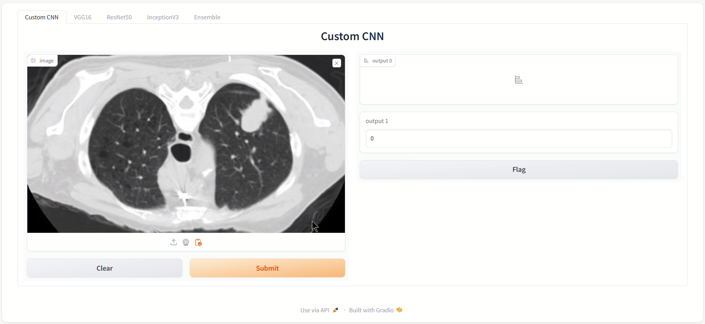

# AI Lung Cancer Detection System

## Overview

This project demonstrates an advanced AI-powered system for detecting lung cancer using CT scan images. The application incorporates a custom Convolutional Neural Network (CNN) and three pre-trained deep learning models (VGG16, ResNet50, and InceptionV3) combined into an ensemble model to enhance diagnostic accuracy. The system is deployed with a user-friendly **Gradio** interface, enabling real-time predictions and visualization.

---

## Key Features
- **Custom CNN Model**: A proprietary CNN model built from scratch for detecting lung cancer.
- **Pre-Trained Models**:
  - **VGG16**: Fine-tuned for CT scan image classification.
  - **ResNet50**: Specialized in handling deep network layers effectively.
  - **InceptionV3**: Fine-tuned for multi-dimensional feature extraction.
- **Ensemble Model**: Combines the predictions of the custom CNN and pre-trained models to improve overall accuracy.
- **Interactive Interface**: Built with **Gradio**, allowing users to upload CT scans and view predictions from individual models and the ensemble.

---

## Gradio Interface

The application includes a tabbed Gradio interface to test predictions across different models. Below is an example of the interface:

### Tabs Description
1. **Custom CNN**: 
   - Upload a CT scan image for prediction.
   - The custom CNN model processes the image and provides the result (Cancer/No Cancer) with a confidence score.

2. **VGG16**:
   - Uses the VGG16 pre-trained model fine-tuned on the lung cancer dataset.
   - Displays prediction and confidence levels.

3. **ResNet50**:
   - Uses ResNet50 for prediction, known for its efficient handling of deep neural networks.

4. **InceptionV3**:
   - Utilizes the InceptionV3 model to classify the uploaded CT scan image.

5. **Ensemble**:
   - Combines predictions from the above models using a voting mechanism to provide a final, consolidated prediction.

---

## Technical Details
- **Language and Frameworks**:
  - Python (TensorFlow, Keras, OpenCV)
  - Gradio for UI development
- **Dataset**: 
  - CT scan images sourced from the NSCLC Radiomics-Genomics dataset (The Cancer Imaging Archive).
- **Preprocessing**:
  - DICOM to grayscale conversion
  - Image resizing (224x224)
  - Normalization and dataset splitting
- **Models**:
  - Custom CNN: Trained from scratch.
  - Pre-trained models: Fine-tuned with a learning rate of 0.001 and batch size of 32.
  - Ensemble: Majority voting for final prediction.

---

## How It Works
1. **Upload CT Scan**: Users upload a CT scan in the Gradio interface.
2. **Prediction**:
   - Each model processes the image and provides predictions and confidence scores.
   - The ensemble model aggregates results for improved accuracy.
3. **Visualization**: Real-time predictions are displayed for user feedback.

---

## Disclaimer
This project is developed for academic purposes and is not intended for clinical use. It is designed to showcase the integration of machine learning models with interactive UI components for healthcare applications.

---

## Contact
For more information, please feel free to connect or explore the repository further.
